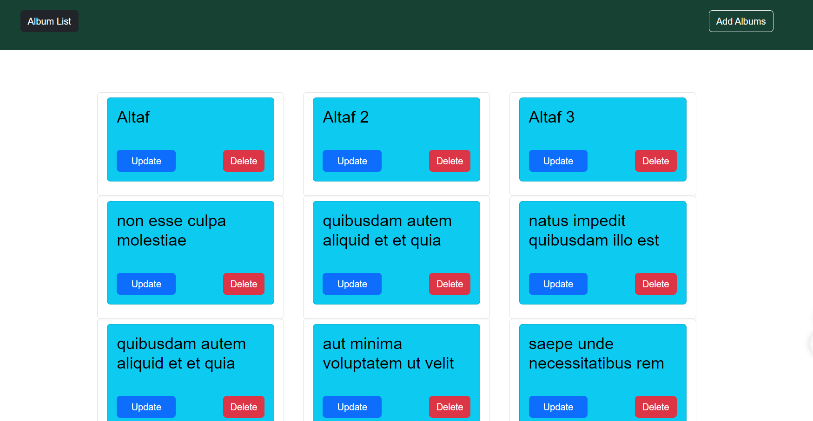

# React Album Management App

## Overview

This is a simple React web application for managing a list of albums. Users can view a list of albums, add new albums, update existing ones, and delete albums from the list.

## Project Structure

- `src/components`: Contains React components for different sections of the application.

  - `App.js`: Main component managing the overall state and routing.
  - `AlbumsList.js`: Component for displaying a list of albums.
  - `AddAlbum.js`: Component for adding new albums to the list.
  - `UpdateAlbum.js`: Component for updating album details.
  - `List.js`: Component for displaying individual albums in the list.
  - `Navbar.js`: Component for the navigation bar.

- `src/index.css`: Stylesheet for styling the application.

- `public/index.html`: HTML template for the React application.

## Styles

- `index.css`: Global styles for the application, including background colors, fonts, and styling for specific components.

## Dependencies

- React: A JavaScript library for building user interfaces.
- React Router: A library for handling routing in React applications.
- Bootstrap: A front-end framework for building responsive and styled components.
- React Toastify: A notification library for displaying toasts.

## Usage

1. Clone the repository.
2. Install dependencies using `npm install`.
3. Run the application with `npm start`.

## Additional Notes

- Make sure to have Node.js and npm installed on your machine.
- The application uses the JSONPlaceholder API for fetching and managing album data.

Feel free to explore and modify the code to suit your specific requirements!
